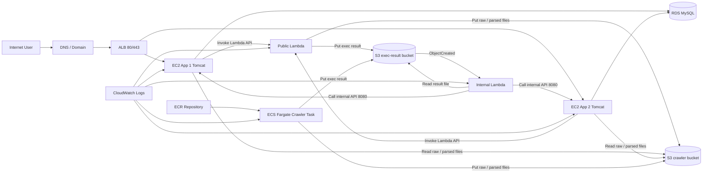

# Sinopac Crawler Prod-Equivalent CDK Design

## 目標

整理 PDF 中的正式環境架構，產出一份可供新建環境使用的「prod 等價重建」規格，並規劃如何以 AWS CDK（TypeScript）實作。

本次交付只包含：

- 正式環境整理版架構圖
- AWS 元件責任與資料流整理
- CDK stack / construct 規劃
- 參數化與命名策略
- 不納入 IaC 的項目
- 待現場補件清單

本次交付不包含：

- 直接撰寫 CDK 程式
- 直接建立 AWS 資源
- 重新設計現有 prod 架構
- 重新定義 crawler 執行模型

## 設計原則

- 新環境必須與既有 prod **行為等價**
- 新環境不追求 console 手動痕跡的字面複製
- 保留現有正式環境的流量路徑、網路邊界、元件分工與觸發鏈
- 將手動建置手冊轉譯成可審計、可重複部署的 IaC 規格
- 將歷史遺留設定與必要設定分開標示

## 範圍界定

### 等價重建包含

- ALB 對外入口與 EC2 應用節點拓樸
- EC2 與 RDS 的私網連線
- 平台觸發 crawler 的流程
- S3 bucket 分工
- 內外部 Lambda 的觸發與回呼
- ECS Fargate / ECR 相關 crawler 執行能力
- CloudWatch log 結構
- IAM / Security Group / VPC endpoint 關係

### 等價重建不包含

- 與 prod 完全相同的資源 ID
- 既有憑證與金鑰明文
- 既有資料庫資料內容
- 透過 console 手動上傳程式檔的流程
- 不可驗證的歷史環境瑕疵

## 正式環境整理版架構

根據 PDF，正式環境的核心結構可整理如下：



## 架構解讀

### 對外入口

- 使用者經 DNS 導向 ALB
- ALB 以 80/443 對外提供服務
- ALB 將流量導向兩台正式環境 EC2 上的 Tomcat 應用

### 平台主體

- 應用平台部署於兩台 EC2
- EC2 透過私網連接 RDS MySQL
- EC2 同時扮演：
  - 使用者入口平台
  - crawler 排程發起者
  - 後續資料入庫與通知執行者

### crawler 執行鏈

- PDF 主流程描述為「平台呼叫 public Lambda 執行 crawler」
- PDF 後段另存在完整的 `ECR + ECS Fargate` 建置與執行說明
- 因你本次要求是與既有 prod 一致，新環境規格必須保留：
  - public Lambda 執行路徑
  - ECS Fargate crawler 執行能力

### 結果回傳鏈

- crawler 完成後將檔案寫入 S3
- exec-result bucket 的 `ObjectCreated` 事件觸發 internal Lambda
- internal Lambda 讀取結果檔後，回呼 EC2 平台內部 API（8080）
- 平台再更新資料庫並做後續處理

### 觀測性

- Lambda、ECS/Fargate、EC2 均有各自 log
- PDF 明確顯示 crawler log 至少包含：
  - `/aws/lambda/...`
  - `ecs/...`

## 與原始手冊相比的整理原則

- 架構圖以「責任」與「流向」為主，不保留逐頁操作細節
- 保留現有 prod 的混合式能力，不主動重構成單一執行模型
- 明確標示 ECS/Fargate 屬於正式環境的一部分，不視為附屬實驗元件
- 將手冊中的 console 操作翻譯為 CDK 可管理資源

## CDK 實作策略

### 推薦方案

採用 **多 stack、單 app、以環境參數驅動的 CDK TypeScript 專案**。

原因：

- 可將網路、資料、運算、觀測拆開，降低單一 stack 複雜度
- 易於跨環境重用相同程式碼
- 可明確界定哪些資源由 CDK 管理，哪些資源需外部提供
- 對「與 prod 等價」這類需求較容易做資源對照與差異審查

### 不採用方案

#### 單一超大 stack

- 優點：檔案少
- 缺點：依賴複雜、部署風險高、變更審查困難

#### 逐頁對照手冊建立資源

- 優點：看似接近原手冊
- 缺點：會把手動痕跡與歷史技術債直接固化進 IaC

## CDK 專案切分

建議 CDK app 內至少切分為下列 stacks。

### 1. NetworkStack

負責：

- VPC
- Public subnets
- Private application subnets
- Private data subnets
- Route tables
- NAT gateway 或既有對應出口策略
- VPC endpoints
- Security groups 基底

重點：

- 需支援 internal Lambda 與 ECS Fargate 的私網執行
- 需保留對 S3、ECR、CloudWatch Logs 等服務的 endpoint 設計能力

### 2. EdgeStack

負責：

- Route53 record
- ACM certificate
- ALB
- listeners
- target groups
- health check 設定

重點：

- 對外入口行為需與 prod 等價
- listener port、TLS 終止方式、target port 必須參數化

### 3. DataStack

負責：

- RDS MySQL
- DB subnet group
- parameter group
- option group（若需要）
- S3 crawler bucket
- S3 exec-result bucket
- bucket encryption
- bucket lifecycle
- bucket policy

重點：

- crawler data bucket 與 exec-result bucket 應分開管理
- 所有 bucket 預設開啟加密與最小必要存取

### 4. ComputeAppStack

負責：

- EC2 instance x2
- IAM instance profile
- EC2 security group
- user data / SSM 基礎設定
- ALB target attachment

重點：

- 本 stack 只建立基礎設施，不負責 WAR 檔部署
- EC2 台數、instance type、AMI 與磁碟大小均需參數化

### 5. ComputeCrawlerStack

負責：

- Lambda layers
- public Lambda
- internal Lambda
- Lambda execution roles
- Lambda security group（若置於 VPC）
- ECR repository
- ECS cluster
- ECS task definition
- Fargate task execution role
- crawler task role

重點：

- public Lambda 與 internal Lambda 明確分離
- ECS crawler task 視為正式環境能力的一部分
- 需保留 task definition、CPU / memory、image tag 的參數化空間

### 6. ObservabilityStack

負責：

- CloudWatch log groups
- log retention
- metric filters
- alarms
- dashboards

重點：

- Lambda、ECS、EC2 log 名稱規則需一致化
- 最低限度應有：
  - ALB 異常
  - EC2 unhealthy
  - Lambda error
  - ECS task failure
  - RDS 可用性告警

### 7. ConfigStack

負責：

- SSM Parameter Store
- Secrets Manager
- stack outputs 匯整

重點：

- 不將敏感資訊寫死在程式碼或 context
- 統一管理跨 stack 共用參數與應用程式讀取位置

## 建議的專案結構

```text
infra/
├── bin/
│   └── app.ts
├── lib/
│   ├── config/
│   │   ├── env-config.ts
│   │   └── naming.ts
│   ├── constructs/
│   │   ├── alb/
│   │   ├── ec2-app/
│   │   ├── ecs-crawler/
│   │   ├── lambda/
│   │   ├── rds/
│   │   └── s3/
│   └── stacks/
│       ├── network-stack.ts
│       ├── edge-stack.ts
│       ├── data-stack.ts
│       ├── compute-app-stack.ts
│       ├── compute-crawler-stack.ts
│       ├── observability-stack.ts
│       └── config-stack.ts
├── cdk.json
├── package.json
└── tsconfig.json
```

## 參數化策略

以下項目必須參數化，不應寫死：

- environment name
- account / region
- VPC CIDR
- public / private subnet CIDR
- domain name
- certificate ARN 或 certificate 建立策略
- EC2 instance type
- EC2 數量
- RDS instance class / storage / engine version
- bucket name prefix
- Lambda memory / timeout
- ECS task CPU / memory
- ECR image tag
- CloudWatch log retention days

## 命名策略

採用統一格式：

```text
<project>-<environment>-<component>
```

範例：

- `crawler-prod-vpc`
- `crawler-prod-alb`
- `crawler-prod-app-sg`
- `crawler-prod-exec-result-bucket`

原則：

- 名稱可讀
- 可預測
- 不依賴手動輸入
- 需要全球唯一的資源（如 S3）再加上 account / region / suffix 策略

## IAM 與權限策略

### EC2

- 可連接 RDS
- 可讀取必要 S3 bucket
- 可呼叫相關 AWS API（若平台需觸發 Lambda）
- 不使用長期 Access Key 寫死在主機

### Public Lambda

- 可寫入 crawler bucket / exec-result bucket
- 可寫入 CloudWatch Logs
- 若需進入 VPC，僅給必要網路存取

### Internal Lambda

- 可讀取 exec-result bucket
- 可呼叫 EC2 平台內部 API
- 可寫入 CloudWatch Logs

### ECS Task

- execution role：拉 ECR image、寫 CloudWatch Logs
- task role：讀寫 S3、必要時讀 SSM / Secrets

## Security Group 與網路邊界

應保留以下邊界概念：

- ALB 對 Internet 開放 80/443
- EC2 僅允許 ALB 對應服務 port 進入
- EC2 允許 internal Lambda 對內部 API port 進入
- RDS 僅允許 EC2 應用節點存取
- internal Lambda 與 ECS Fargate 優先走私網與 service endpoint

這些規則必須由 CDK 明確宣告，不留給 console 手調。

## 資源對照表

| PDF 元件 | AWS 資源 | CDK Stack | 備註 |
|---|---|---|---|
| 對外網址入口 | Route53 / ACM / ALB | EdgeStack | domain 與憑證需參數化 |
| 正式站台應用 | EC2 x2 + Tomcat | ComputeAppStack | WAR 部署不納入本次 |
| 關聯式資料庫 | RDS MySQL | DataStack | 版本與參數組需現場補 |
| 爬蟲資料 bucket | S3 bucket | DataStack | 存 raw / parsed 檔 |
| 執行結果 bucket | S3 bucket | DataStack | 觸發 internal Lambda |
| 外部 crawler Lambda | Lambda + Layer | ComputeCrawlerStack | 保留 prod 等價能力 |
| 內部 callback Lambda | Lambda + Layer + SG | ComputeCrawlerStack | 需進 VPC 或可達 EC2 |
| crawler image 倉庫 | ECR | ComputeCrawlerStack | image lifecycle 可另設 |
| crawler 執行容器 | ECS Cluster / Task Definition | ComputeCrawlerStack | Fargate 路徑保留 |
| 觀測性 | CloudWatch Logs / Alarm | ObservabilityStack | retention 與 alarm 需定義 |
| 密鑰與設定 | SSM / Secrets Manager | ConfigStack | 不再沿用明文手填 |

## 資源盤點依據

正式環境元件與 CDK stack 歸屬，進一步整理於：

- `docs/sinopac-crawler-prod-equivalent-cdk/resource-matrix.md`
- `docs/sinopac-crawler-prod-equivalent-cdk/parameters.md`

後續實作與現場補件，均以這兩份文件作為盤點基線。

## Cross-Stack Reference Strategy

- `NetworkStack` 輸出：
  - VPC
  - public / private subnets
  - shared security groups
  - VPC endpoint 相關資訊
- `EdgeStack` 依賴：
  - `NetworkStack` 的 public subnets
  - `ComputeAppStack` 對應的 target attachments
- `DataStack` 依賴：
  - `NetworkStack` 的 data subnets 與 DB 相關 security groups
- `ComputeAppStack` 依賴：
  - `NetworkStack` 的 app subnets / SG
  - `DataStack` 的 RDS endpoint、DB secret reference、S3 bucket references
- `ComputeCrawlerStack` 依賴：
  - `NetworkStack` 的 private subnets / SG
  - `DataStack` 的 S3 bucket references
  - `ConfigStack` 的參數與 secret references
- `ObservabilityStack` 依賴：
  - 其他 stacks 的 log group names、alarm targets、resource identifiers

原則：

- 優先使用 construct props 與 stack outputs 傳遞強型別資源引用
- 避免在 stack 間傳遞硬編碼字串
- 僅將真正需要跨 stack 使用的資訊設為 output

## Deployment Order

1. `ConfigStack`
2. `NetworkStack`
3. `DataStack`
4. `ComputeAppStack`
5. `ComputeCrawlerStack`
6. `EdgeStack`
7. `ObservabilityStack`

說明：

- `ConfigStack` 先建立全域參數與 secret 容器
- `NetworkStack` 提供後續所有 stack 的底層網路
- `DataStack` 建立資料與 bucket 依賴
- `ComputeAppStack` 與 `ComputeCrawlerStack` 建立主要運算元件
- `EdgeStack` 最後綁定對外入口到實際 app targets
- `ObservabilityStack` 在元件名稱與 log group 明確後建立 alarm / dashboard

## IaC Boundary And Handoff

CDK 專案負責：

- 建立 AWS 資源
- 產出可審計的 stack 差異
- 將環境差異收斂到參數與 secret
- 明確宣告網路、權限、資料與觸發鏈

CDK 專案不負責：

- 部署 Java WAR
- build / push crawler image
- 打包 Lambda 商業邏輯 artifact
- 匯入正式資料
- 執行應用程式層級資料修復

上述項目需由後續 deployment pipeline 或作業手冊承接。

## 不納入 IaC 的項目

以下項目不應由基礎設施 CDK 直接管理：

- Java 應用 WAR 檔內容
- 爬蟲商業邏輯程式碼內容
- 手動上傳 ZIP 到 Lambda 的舊流程
- 手動 docker build / push 操作本身
- 資料庫既有資料搬遷
- 正式憑證私鑰內容

若未來要進一步自動化，應另建：

- 應用部署 pipeline
- crawler image build / release pipeline
- Lambda package build pipeline

## 待現場補件清單

PDF 足以支撐架構規格，但不足以支撐 100% 可部署的 CDK 細節。以下資料需向現場補齊：

- VPC CIDR 與 subnet 實際切分
- 是否有 NAT gateway / NAT instance
- ALB listener port、target port、health check path
- EC2 instance type、AMI、EBS 配置
- RDS engine version、instance class、storage、backup policy
- S3 bucket 命名規則、encryption、lifecycle、policy 細節
- Lambda runtime、memory、timeout、VPC 掛載方式
- Lambda layer 實際來源與版本策略
- ECS cluster 名稱、task definition family、CPU / memory、subnet / SG
- ECR repository naming 與 image tag policy
- CloudWatch log group 實際命名規則與 retention
- 目前 prod IAM role policy 內容
- 應用程式目前透過哪些參數讀取 bucket / role / endpoint
- 憑證取得方式與 DNS 託管範圍

## 驗收標準

這份規格完成後，應可支撐下一步撰寫 CDK implementation plan，並能回答：

- 新環境需要哪些 AWS 資源
- 每個資源應由哪個 stack 建立
- 哪些值需要參數化
- 哪些項目不屬於 IaC 範圍
- 需要向現場補哪些資訊才能開始實作

## 下一步

下一步應基於本規格撰寫 implementation plan，內容至少包含：

- CDK 專案初始化方式
- stack 建立順序
- cross-stack reference 策略
- 各 stack 的實作任務清單
- 驗證與部署順序
- 現場補件依賴點
